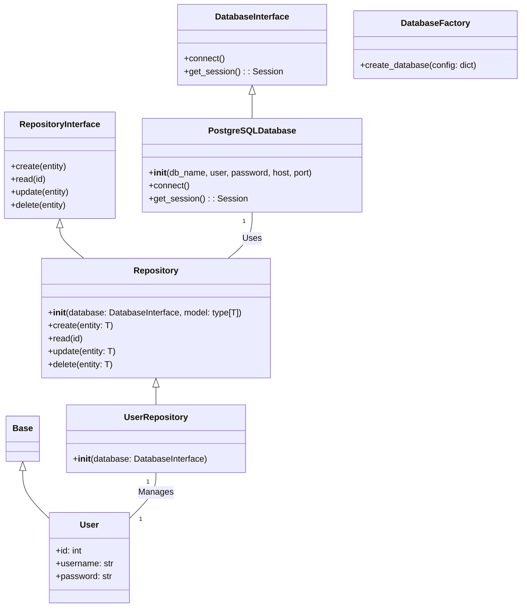
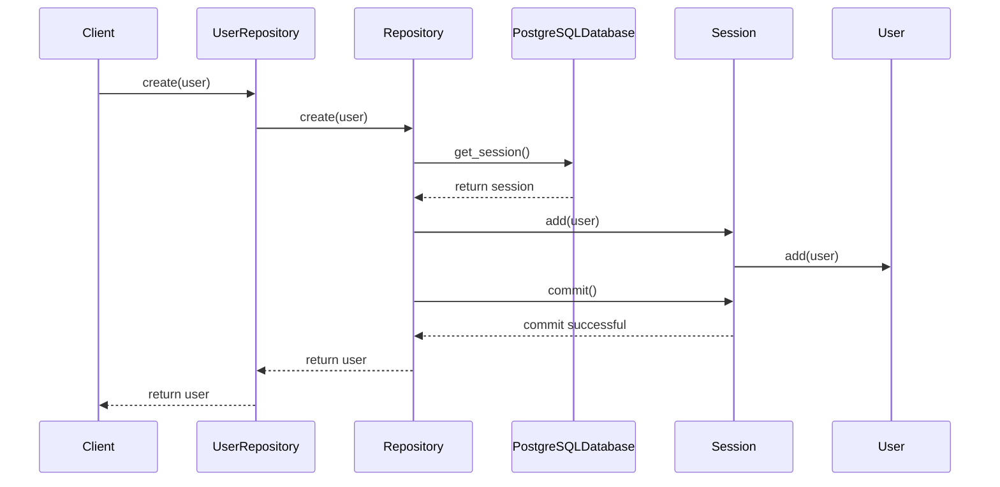

# CRUD Repository 

---
Description of your package.

## Installation

```bash
pip install CRUDRepository

## Class Diagram



### In this diagram:

- `Base` is a base class for all models, and User is a specific model that extends Base.
- `DatabaseInterface` is an abstract base class that defines the interface for a database, and PostgreSQLDatabase is a concrete implementation of this interface.
- `DatabaseFactory` is a factory class that creates instances of PostgreSQLDatabase.
- `RepositoryInterface` is an abstract base class that defines the interface for a repository, and Repository is a generic implementation of this interface.
- `UserRepository` is a specific repository that manages User instances.
- `PostgreSQLDatabase` is used by Repository, and UserRepository manages User instances.

---

## Sequence Diagram



### In this diagram:  

- `Client` represents the client code that interacts with the UserRepository.
- `UserRepository` is a specific repository that manages User instances.
- `Repository` is a generic implementation of a repository.
- `PostgreSQLDatabase` is a concrete implementation of a database interface.
- `Session` represents a database session.
- `User` represents a user instance.

The sequence diagram shows the process of creating a new user. The client 
calls the create method on the UserRepository, which in turn calls the create 
method on the Repository. The Repository gets a session from the PostgreSQLDatabase, 
adds the user to the session, and commits the session. The user is then returned 
to the client.

---

## Code Example Usage

```python
#!/usr/bin/env python3
# -*- coding: utf-8 -*-
from myLogger.Logger import get_logger
from src.db.database import DatabaseFactory
from test.user import User
from src.repo.repository import UserRepository

log = get_logger(__name__)

# ---------------------------------------------------------
if __name__ == '__main__':
    # Create a new database instance
    db_config = {
        'type': 'postgresql',
        'db_name': 'volunteer',
        'user': "postgres",
        'password': "adminpassword",
        'host': "127.0.0.1",
        'port': "5432"
    }
    log.info(f"""Database Config: {db_config}""")
    db = DatabaseFactory.create_database(db_config)
    log.info(f"""Database: {db.__dict__()}""")

    # Create a UserRepository instance with the database instance
    user_repo = UserRepository(db)
    log.info(f"""User Repository: {user_repo.__dict__()}""")

    # Create a new user
    user = User(username='Candy', password='password')
    user_repo.create(user)
    log.info(f"""User: {user}""")
```

---
