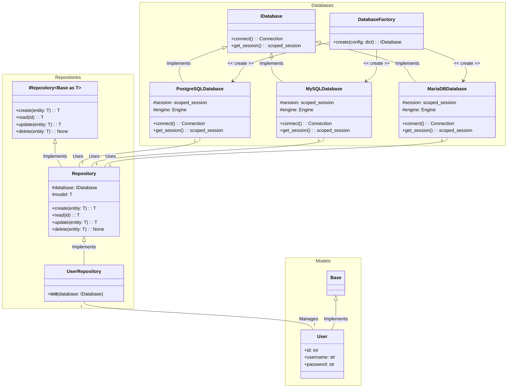
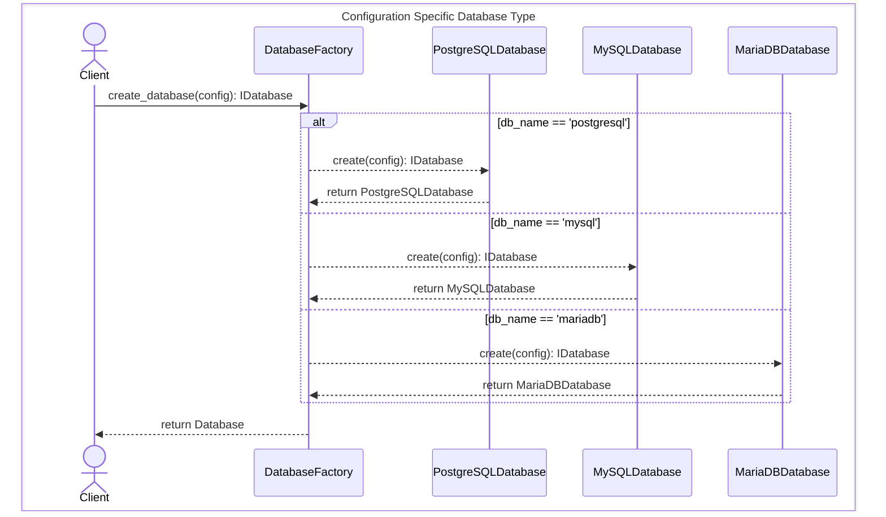
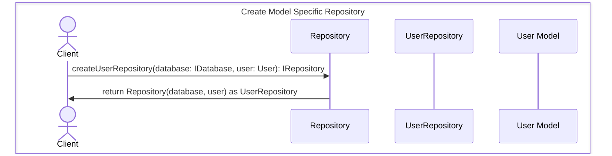
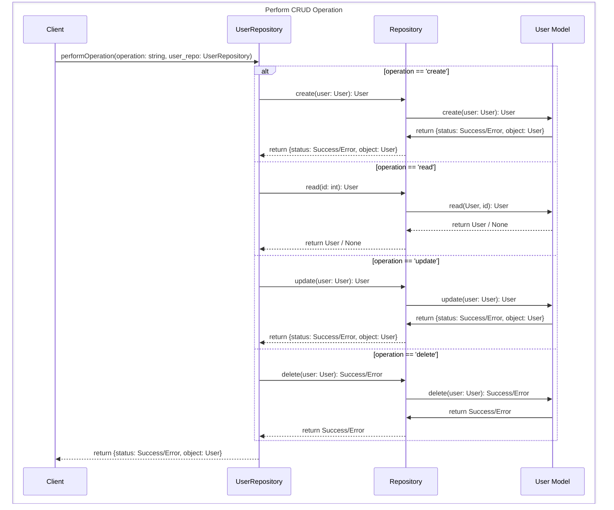
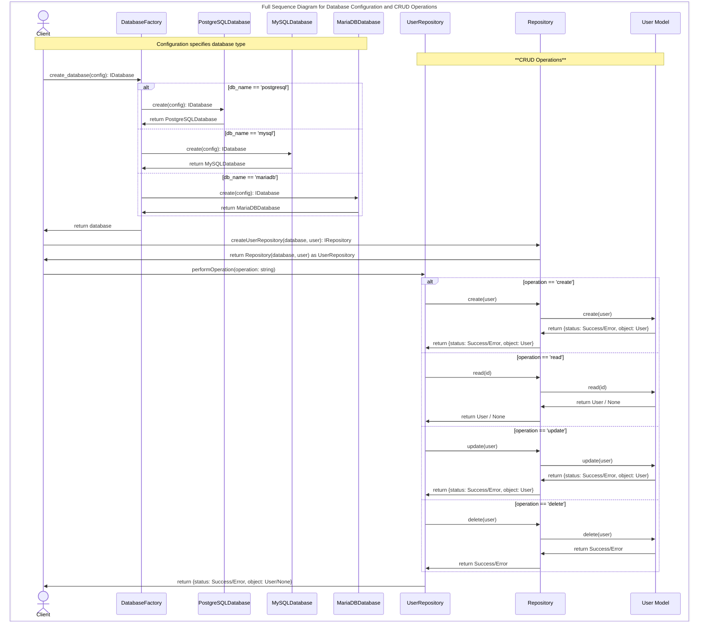

[](https://github.com/dellius-alexander/CRUDRepository/actions/workflows/deploy.yml)

---

# CRUD Repository

---
## Description

The CRUDRepository is a Python project designed to provide a 
generic implementation of Create, Read, Update, and Delete (CRUD) 
operations for various databases. It uses the Repository design pattern 
to abstract the data access layer, allowing for easy switching between 
different databases using the Factory pattern in which each database 
object implements a Singleton object.  

The project includes classes for handling different types of databases 
such as PostgreSQL, MySQL, and MariaDB. Each of these classes implements 
a common Interface, ensuring a consistent method of interaction 
regardless of the underlying database.  

The CRUDRepository also includes a Repository class that provides generic 
CRUD operations. This class can be used as a base for creating more specific 
repositories, like the test Repository UserRepository included in the project, which is 
designed to manage User instances.  

The project uses SQLAlchemy for ORM, providing a high-level, Pythonic 
interface for database operations. It also includes a DatabaseFactory for 
creating instances of the appropriate database class based on provided 
configuration.  

In summary, CRUDRepository is a flexible and extensible 
foundation for Python applications that require database interactions, 
abstracting the complexities of direct database access and providing a 
clear and simple interface for performing CRUD operations.

## Class Diagram



### In this diagram (Class Diagram):

* `Base` is a base class for all models, and `User` is a specific model that extends `Base`.
* `IDatabase` is an abstract base class that defines the interface for a database. `PostgreSQLDatabase`, `MySQLDatabase`, and `MariaDBDatabase` are concrete implementations of this interface.
* `DatabaseFactory` is a factory class that creates instances of `PostgreSQLDatabase`, `MySQLDatabase`, or `MariaDBDatabase` based on the provided configuration.
* `IRepository ~T~` is an abstract base class that defines the interface for a repository, and `Repository ~Base~` is a generic implementation of this interface that is bound to the `Base` model class.
* `UserRepository` is a specific repository that manages `User` instances.
* `PostgreSQLDatabase`, `MySQLDatabase`, and `MariaDBDatabase` are used by `Repository ~Base~`, and `UserRepository` manages `User` instances.

---

## Sequence Diagrams

---

### Create Specific Database Type



#### In this diagram (Sequence Diagram):

The diagram illustrates how a client can configure a database connection based on a provided database type. This process highlights the roles of various classes and their collaborative interactions. 

#### Classes:

* **Client**: The actor initiating the database configuration process.
* **DatabaseFactory**: A factory class responsible for creating specific database instances.
* **PostgreSQLDatabase, MySQLDatabase, MariaDBDatabase**: Concrete database classes representing the different database types.
* **IDatabase**: An interface defining the contract for database interactions.

#### Interactions:

* The `Client` sends a `create_database` request, including configuration details, to the `DatabaseFactory`.
* The `DatabaseFactory` determines the appropriate database type (postgresql, mysql, or mariadb).
* Based on the type, the `DatabaseFactory` creates an instance of the corresponding database class.
* The created database object (implementing the `IDatabase` interface) is returned to the `Client`.

---

### Create Model Specific Repository



#### In this diagram (Sequence Diagram):

This sequence diagram illustrates the process of creating a repository tailored specifically for managing `User` data. This provides organized data access for the `Client`.

#### Classes:

* `Client`: Initiates the repository creation process.
* `User Repository`: A repository designed to handle all data operations related to the `User` model.
* `Repository`: A base class offering fundamental data access functionality.
* `User Model`: The model representing a user within the system.

#### Interactions:

* The `Client` sends the `createUserRepository` request to the `Repository` class, providing a database (`IDatabase`) instance and the `User` model.
* The `Repository` constructs a repository instance, specifically configured to work with the `User` model and the supplied database.
* The `Repository` returns the newly formed `User Repository` object back to the `Client`.

---

### Perform CRUD Operation on User model



### In this diagram (Sequence Diagram):

This diagram depicts how a client performs CRUD (Create, Read, Update, Delete) operations on the User model through the `UserRepository`.

* `Client`: Triggers CRUD operations by calling performOperation on the UserRepository.
* `UserRepository`: Delegates the operation to the underlying Repository, providing context (User model information).
* `Repository`:  Interacts directly with the IDatabase instance to execute the database operations.
* `User Model`: Represents the abstraction for database interaction.

#### Interactions:

* The `Client` calls performOperation on the `UserRepository`, specifying the desired operation type (create, read, update, or delete) .
* The `UserRepository` delegates the execution to the `Repository` instance.
* The `Repository` interacts with the underlying `Database` implementation to perform the specified database operation.
* The success or failure result, along with any data, is returned back through the `Repository` and `UserRepository` layers to the `Client`.

#### Key Points:

* `Abstraction`: Interfaces like IDatabase promote flexibility, allowing the system to swap database implementations easily.

* `Separation of Concerns`:  The diagrams demonstrate how responsibilities are divided: 
  * The client manages user interaction.
  * Factories handle object creation.
  * Repositories encapsulate data access logic.
  * Database classes focus on database-specific interactions.

---

### Full Sequence Diagram for Database Configuration and CRUD Operations




---

## Installation
    
```bash
pip install crud-repository
```

## Code Example Usage

```python
#!/usr/bin/env python3
# -*- coding: utf-8 -*-
from crud_repository.db.factory import DatabaseFactory
from typing import Optional
from sqlalchemy import Column, Sequence, Integer, String
from sqlalchemy.orm import Mapped
from crud_repository.model.base import Base
from db.idatabase import IDatabase
from crud_repository.repo.repository import Repository


# ---------------------------------------------------------
# Create a User model
# ---------------------------------------------------------
class User(Base):
    __tablename__ = "user"

    id: Mapped[int] = Column(
        Integer,
        Sequence("user_id_seq"),
        primary_key=True,
        autoincrement=True,
        nullable=False,
        unique=True,
        index=True,
    )
    username: Mapped[str] = Column(String(128), nullable=False)
    password: Mapped[Optional[str]] = Column(String(128), nullable=True)

    def to_dict(self) -> dict:
        return {"id": self.id, "username": self.username, "password": self.password}

    def as_dict(self) -> dict:  # renamed from __dict__ to as_dict
        return self.to_dict()

    def __repr__(self) -> str:
        return (
            f"User(id={self.id!r}, name={self.username!r}, fullname={self.password!r})"
        )


# ---------------------------------------------------------
# Create a UserRepository instance with the database instance
# ---------------------------------------------------------
class UserRepository(Repository[User]):
    def __init__(self, database: IDatabase):
        super().__init__(database, User)


# ---------------------------------------------------------
# Create a new user
# ---------------------------------------------------------
if __name__ == '__main__':
    # Create a new database instance
    db_config = {
        'type': 'postgresql',
        'db_name': 'volunteer',
        'user': "postgres",
        'password': "adminpassword",
        'host': "127.0.0.1",
        'port': "5432"
    }
    # Create a new database instance
    db = DatabaseFactory.create(db_config)

    # Create a UserRepository instance with the database instance
    user_repo = UserRepository(db)

    # OR create a generic Repository instance with the 
    # database instance and the User model
    #user_repo = Repository(db, User)

    # Create a new user
    user = User(username='Candy', password='password')

    # Add the user to the database
    user_repo.create(user)
```
---
