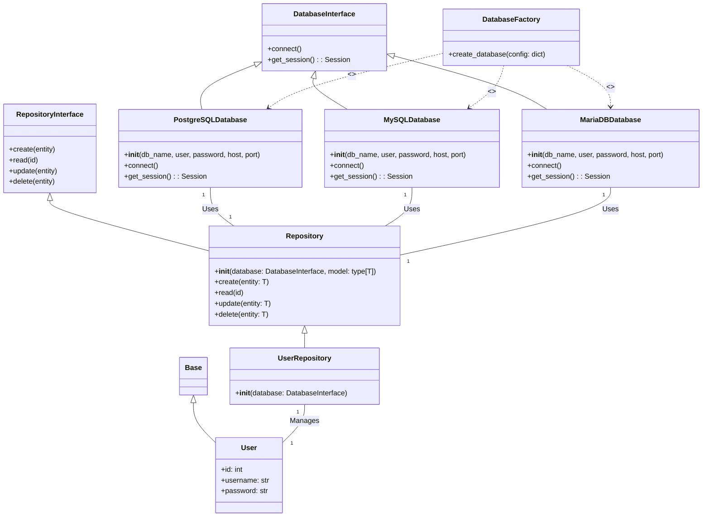
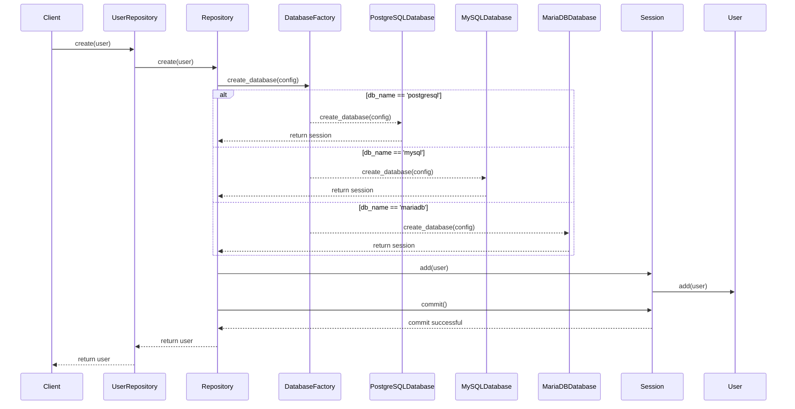

# CRUD Repository 

---

## Description

The CRUDRepository is a Python project designed to provide a 
generic implementation of Create, Read, Update, and Delete (CRUD) 
operations for various databases. It uses the concept of repositories 
to abstract the data access layer, allowing for easy switching between 
different databases.  

The project includes classes for handling different types of databases 
such as PostgreSQL, MySQL, and MariaDB. Each of these classes implements 
a common DatabaseInterface, ensuring a consistent method of interaction 
regardless of the underlying database.  

The CRUDRepository also includes a Repository class that provides generic 
CRUD operations. This class can be used as a base for creating more specific 
repositories, like the test Repository UserRepository included in the project, which is 
designed to manage User instances.  

The project uses SQLAlchemy for ORM, providing a high-level, Pythonic 
interface for database operations. It also includes a DatabaseFactory for 
creating instances of the appropriate database class based on provided 
configuration.  

In summary, CRUDRepository is a flexible and extensible 
foundation for Python applications that require database interactions, 
abstracting the complexities of direct database access and providing a 
clear and simple interface for performing CRUD operations.

## Class Diagram



### In this diagram (Class Diagram):

- `Base` is a base class for all models, and `User` is a specific model that extends `Base`.
- `DatabaseInterface` is an abstract base class that defines the interface for a database. `PostgreSQLDatabase`, `MySQLDatabase`, and `MariaDBDatabase` are concrete implementations of this interface.
- `DatabaseFactory` is a factory class that creates instances of `PostgreSQLDatabase`, `MySQLDatabase`, or `MariaDBDatabase` based on the provided configuration.
- `RepositoryInterface` is an abstract base class that defines the interface for a repository, and `Repository` is a generic implementation of this interface.
- `UserRepository` is a specific repository that manages `User` instances.
- `PostgreSQLDatabase`, `MySQLDatabase`, and `MariaDBDatabase` are used by `Repository`, and `UserRepository` manages `User` instances.

---

## Sequence Diagram




### In this diagram (Sequence Diagram):

- `Client` represents the client code that interacts with the `UserRepository`.
- `UserRepository` is a specific repository that manages `User` instances.
- `Repository` is a generic implementation of a repository.
- `DatabaseFactory` is a factory class that creates instances of `PostgreSQLDatabase`, 
`MySQLDatabase`, or `MariaDBDatabase` based on the provided configuration.
- `PostgreSQLDatabase`, `MySQLDatabase`, and `MariaDBDatabase` are concrete implementations of a database interface.
- `Session` represents a database session.
- `User` represents a user instance.

The sequence diagram shows the process of creating a new user. The client calls the `create` 
method on the `UserRepository`, which in turn calls the `create` method on the `Repository`. 
The `Repository` gets a session from the `DatabaseFactory` which creates an instance of 
either `PostgreSQLDatabase`, `MySQLDatabase`, or `MariaDBDatabase` based on the provided 
configuration. The `Repository` adds the user to the session, and commits the session. 
The user is then returned to the client.

---

## Code Example Usage

```python
#!/usr/bin/env python3
# -*- coding: utf-8 -*-
from src.myLogger.Logger import get_logger
from src.db.database import DatabaseFactory
from typing import Optional
from sqlalchemy import Column, Sequence, Integer, String
from sqlalchemy.orm import Mapped
from src.model.base import Base
from db.database import DatabaseInterface
from src.repo.repository import Repository

log = get_logger(__name__)

# ---------------------------------------------------------
# Create a User model
# ---------------------------------------------------------
class User(Base):
    __tablename__ = "user"

    id: Mapped[int] = Column(
        Integer,
        Sequence("user_id_seq"),
        primary_key=True,
        autoincrement=True,
        nullable=False,
        unique=True,
        index=True,
    )
    username: Mapped[str] = Column(String(128), nullable=False)
    password: Mapped[Optional[str]] = Column(String(128), nullable=True)

    def to_dict(self) -> dict:
        return {"id": self.id, "username": self.username, "password": self.password}

    def as_dict(self) -> dict:  # renamed from __dict__ to as_dict
        return self.to_dict()

    def __repr__(self) -> str:
        return (
            f"User(id={self.id!r}, name={self.username!r}, fullname={self.password!r})"
        )


# ---------------------------------------------------------
# Create a UserRepository instance with the database instance
# ---------------------------------------------------------
class UserRepository(Repository[User]):
    def __init__(self, database: DatabaseInterface):
        super().__init__(database, User)
      
        
# ---------------------------------------------------------
# Create a new user
# ---------------------------------------------------------
if __name__ == '__main__':
    # Create a new database instance
    db_config = {
        'type': 'postgresql',
        'db_name': 'volunteer',
        'user': "postgres",
        'password': "adminpassword",
        'host': "127.0.0.1",
        'port': "5432"
    }
    log.info(f"""Database Config: {db_config}""")
    db = DatabaseFactory.create_database(db_config)
    log.info(f"""Database: {db.__dict__()}""")

    # Create a UserRepository instance with the database instance
    user_repo = UserRepository(db)
    log.info(f"""User Repository: {user_repo.__dict__()}""")

    # Create a new user
    user = User(username='Candy', password='password')
    user_repo.create(user)
    log.info(f"""User: {user}""")
```

---


